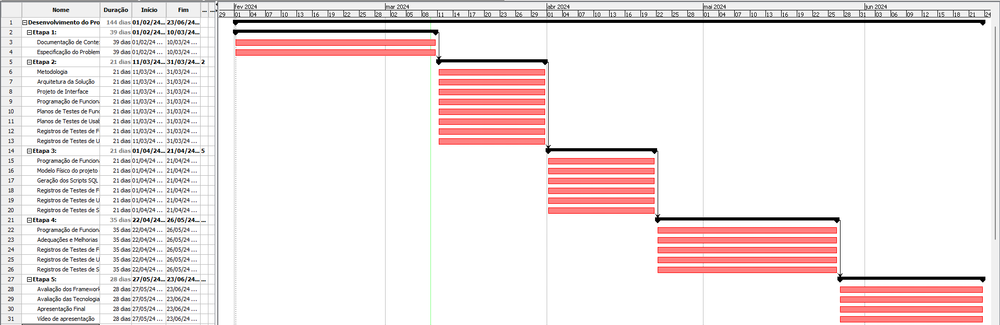
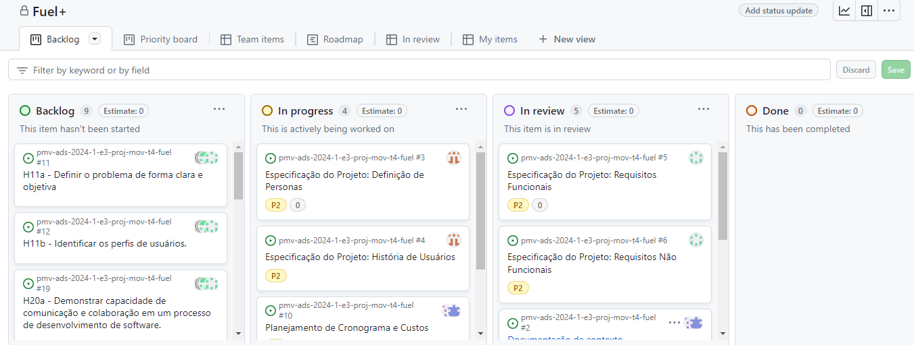
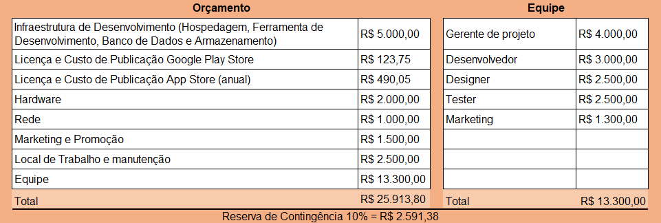

# Especificações do Projeto

Pré-requisitos: <a href="1-Documentação de Contexto.md"> Documentação de Contexto</a>

Definição do problema e ideia de solução a partir da perspectiva do usuário. É composta pela definição do  diagrama de personas, histórias de usuários, requisitos funcionais e não funcionais além das restrições do projeto.

Apresente uma visão geral do que será abordado nesta parte do documento, enumerando as técnicas e/ou ferramentas utilizadas para realizar a especificações do projeto

## Personas

**José Geraldo** 48 anos, é caminhoneiro com ensino médio completo. Ele utiliza a aplicação com o objetivo de economizar, valorizando a praticidade que a aplicação oferece para otimizar suas viagens de frete por todo o Brasil.

**Camila Pontes** 21 anos, está se graduando em Psicologia e busca praticidade ao utilizar a aplicação para encontrar combustível e serviços de manutenção para seu carro. Sua motivação na consiste em tranquilidade, praticidade e preços acessíveis que a aplicação pode proporcionar.

**Fernanda Brant** 35 anos, é representante comercial e busca praticidade e segurança ao utilizar a aplicação. Sua rotina diária de trabalho requer otimização do tempo para abastecer seu carro e realizar manutenções preventivas, visando preços justos e qualidade nos serviços.

**Roberto Barbosa** 40 anos, trabalha como motorista de aplicativo e utiliza a aplicação para abastecer seu veículo e realizar manutenções com custo-benefício. Ele almeja tranquilidade e redução de custos, dado que depende constantemente desses serviços para manter seu veículo em condições ideais.

**Nilton Novaes** 65 anos, é aposentado e utiliza a aplicação para suas rotinas diárias, incluindo suas viagens para a roça com a família nos finais de semana. Sua falta de familiaridade com a tecnologia demanda apoio dos filhos na utilização do aplicativo. Seu objetivo é facilitar suas atividades cotidianas e desfrutar de momentos de descanso com sua família.
 
**Locadora de veículos** Essas empresas necessitam de manutenções programadas e abastecimento regular para assegurar a eficiência operacional de sua frota de veículos, a economia, agilidade e serviços de qualidade são primordiais.

## Histórias de Usuários

Com o ensejo de entender melhor as personas identificadas no projeto, foram identificadas as seguintes histórias de usuários. 

|EU COMO... `PERSONA`| QUERO/PRECISO ... `FUNCIONALIDADE` |PARA ... `MOTIVO/VALOR`                 |
|--------------------|------------------------------------|----------------------------------------|
|JOSÉ | Poder viajar tranquilamente; Ter economia ; Ter segurança ; Pagar preço justo| Economizar; viagens são longas; custos são mais altos o que pode gerar grandes prejuízos.
|CAMILA      | Ter tranquilidade; Ter praticidade Ter preço baixo.                 | O objetivo para usar a aplicação, é ter praticidade; para encontrar combustível; Encontrar prestadores de serviços para manutenção do seu carro. |
|FERNANDA  | Rotina intensa de trabalho; Otimizar o tempo para o abastecimento do carro e as manutenções preventivas, Ter preço justo.    |Tem o objetivo de usar a aplicação no intuito de praticidade e segurança.          |
|ROBERTO    |Objetivo de usar a aplicação para o abastecimento do seu veículo; manutenções programadas; ter um bom custo benefício.                  |Ter tranquilidade; Redução dos custos, tendo em vista que ele sempre necessita de serviços de manutenções básicas.
|NILTON    |Objetivo de usar a aplicação para o abastecimento do seu veículo; manutenções programadas; ter um bom custo benefício.                  |Sua finalidade é ter tranquilidade  redução dos custos, tendo em vista que ele sempre necessita de serviços de manutenções básicas. Dificuldade tecnologica, pode precisar de auxílio para utilização da aplicação.
|LOCADORA    |Objetivo de usar a aplicação para o abastecimento dos veículos da frota; manutenções programadas; ter economia; ter serviços rápidos e de qualidade               |Sua finalidade é ter tranquilidade  redução dos custos, agilidade e qualidade.

## Modelagem do Processo de Negócio 

### Análise da Situação Atual

Apresente aqui os problemas existentes que viabilizam sua proposta. Apresente o modelo do sistema como ele funciona hoje. Caso sua proposta seja inovadora e não existam processos claramente definidos, apresente como as tarefas que o seu sistema pretende implementar são executadas atualmente, mesmo que não se utilize tecnologia computacional. 

### Descrição Geral da Proposta

Apresente aqui uma descrição da sua proposta abordando seus limites e suas ligações com as estratégias e objetivos do negócio. Apresente aqui as oportunidades de melhorias.

### Processo 1 – NOME DO PROCESSO

Apresente aqui o nome e as oportunidades de melhorias para o processo 1. Em seguida, apresente o modelo do processo 1, descrito no padrão BPMN. 

### Processo 2 – NOME DO PROCESSO

Apresente aqui o nome e as oportunidades de melhorias para o processo 2. Em seguida, apresente o modelo do processo 2, descrito no padrão BPMN.

## Indicadores de Desempenho

Apresente aqui os principais indicadores de desempenho e algumas metas para o processo. Atenção: as informações necessárias para gerar os indicadores devem estar contempladas no diagrama de classe. Colocar no mínimo 5 indicadores. 

Usar o seguinte modelo: 

Obs.: todas as informações para gerar os indicadores devem estar no diagrama de classe a ser apresentado a posteriori. 

## Requisitos do Projeto
O escopo funcional do projeto é definido por meio dos requisitos funcionais que descrevem as possibilidades interação dos usuários, bem como os requisitos não funcionais que descrevem os aspectos que o sistema deverá apresentar de maneira geral. Estes requisitos são apresentados a seguir. 

### Requisitos Funcionais
A tabela a seguir apresenta os requisitos do projeto, identificando a prioridade em que os mesmos devem ser entregues. 
|ID    | Descrição dos Requisitos | Prioridade |
|------|-----------------------------------------|----|
|RF-01 | A aplicação permitirá o login por meio de Email e senha cadastrados previamente.   | ALTA |
|RF-02 | A aplicação deve permitir ao usuário logado realizar pesquisa da localização dos estabelecimentos conforme sua necessidade utilizando para tal o Cep ou digitando manualmente o logradouro.    | ALTA |
|RF-03 | A aplicação deve oferecer a lista de estabelecimentos cadastrados com nome, bandeira, preço, endereço e a distância entre o usuário e o serviço disponível.    | ALTA | 
|RF-04 | A aplicação deve permitir ao administrador o cadastro do estabelecimento informando: preço e tipo de combustível, bandeira do posto, endereço, horário de funcionamento e outros serviços adicionais | ALTA |
|RF-05 | A aplicação deve permitir atualizar as informações previamente cadastradas.  | ALTA |
|RF-06 | A aplicação deve permitir ao administrador excluir informações devidamente comprovadas como falsas ou incorretas.    | ALTA |
|RF-07 | A aplicação deve pedir ao usuário que recupere sua senha a partir do Email previamente cadastrado.  | ALTA |
|RF-08 | A aplicação deve permitir que os usuários realizem pesquisas de preço, tipo de combustível e bandeira do posto.    | MÉDIA |
|RF-09 | A aplicação deverá disponibilizar um serviço de atendimento ao usuário.    | MÉDIA |
|RF-10 | A aplicação deverá ser integrada a um serviço de GPS para que trace a rota ideal do usuário até o posto desejado.   | MÉDIA |
|RF-11| A aplicação deverá permitir que o usuário envie uma foto dos preços do posto para auxiliar na atualização das informações do app. | MÉDIA |
|RF-12 | A aplicação deverá permitir ao usuário favoritar posto. | BAIXA | 
|RF-13| A aplicação deverá permitir a avaliação do usuário. | BAIXA |

### Requisitos não Funcionais
A tabela a seguir apresenta os requisitos não funcionais que o projeto deverá atender.
|ID     | Descrição do Requisito | Prioridade |
|-------|-------------------------|-----------|
|RNF-01 | A aplicação deve ser publicada em um ambiente acessível publicamente na Internet (Repl.it, GitHub Pages, Heroku).   | ALTA | 
|RNF-02 | A aplicação deverá ser responsiva permitindo a visualização em um celular de forma adequada.  | ALTA | 
|RNF-03 | A interface da aplicação deve ser intuitiva para que atenda a todos os públicos.   |  ALTA | 
|RNF-04 | A aplicação deve ser compatível com os principais sistemas operacionais do mercado. |  ALTA | 
|RNF-05 | A aplicação deve ter bom nível de contraste entre os elementos da tela em conformidade.    |  MÉDIA | 
|RNF-06 | Os dados pessoais dos usuários, que forem coletados na aplicação deverão ser criptografados. | ALTA |

## Restrições
As questões que limitam a execução desse projeto e que se configuram como obrigações claras para o desenvolvimento do projeto em questão são apresentadas na tabela a seguir. 
|ID| Restrição                                             |
|--|-------------------------------------------------------|
|RE-01 |O projeto deverá ser entregue no final do semestre letivo, não podendo extrapolar a data de 23/06/2024   |
|RE-02 | O aplicativo deve se restringir às tecnologias do framework. |
|RE-03 | A equipe não pode subcontratar o desenvolvimento do trabalho. |
|RE-04| A aplicação será desenvolvida apenas para dispositivos mobile. | 

## Diagrama de Casos de Uso

O diagrama contempla as principais ligações previstas entre casos de uso e atores e permite detalhar os Requisitos Funcionais identificados na etapa de elicitação. Lembrando que  não se utiliza diagramas de caso de uso para requisitos não-funcionais. 
Como atores é importante a identificação dos grupos de todos os envolvidos que interagem com o sistema, principalmente outros sistemas ou sensores. Eles são representados graficamente por bonecos-palito e serão nomeados pelos papéis nas interações nas quais estão envolvidos (ex. Cliente, Administrador). Lembre-se de que o próprio sistema não pode ser ator do diagrama que o modela. 
Em relação aos casos de uso, eles devem representar as interações ou transações dos atores com o sistema. Cada tipo possível é representada por uma elipse nomeada e os relacionamentos são indicados por linhas que podem ter setas nos casos em que se indica a origem da interação. Os nomes dos casos de uso representam verbos no infinitivo associados aos objetos com os quais se relacionam os verbos (ex. Cadastrar usuário, Visualizar relatório). Os tipos de relacionamentos mais comuns são associações entre atores e casos de uso, generalizações entre atores e entre casos de uso, inclusões e extensões entre casos de uso. 

# Matriz de Rastreabilidade

A matriz de rastreabilidade é uma ferramenta usada para facilitar a visualização dos relacionamento entre requisitos e outros artefatos ou objetos, permitindo a rastreabilidade entre os requisitos e os objetivos de negócio. 

A matriz deve contemplar todos os elementos relevantes que fazem parte do sistema. Foram incluídos os relacionamentos entre requisitos funcionais e stakeholders. Os requisitos não funcionais não foram incluídos pois relacionam-se com todos os demais.

| INFORMAÇÃO | RF-01 | RF-02 | RF-03 | RF-04 | RF-05 | RF-06 | RF-07 | RF-08 | RF-09 | RF-10 | RF-11 | RF-12 | RF-13 | USUÁRIO | ADM | 
|------------|-------|-------|-------|-------|-------|-------|-------|-------|-------|-------|-------|-------|-------|---------| ----|
| RF-01      |       |       |       |       |   X   |       |   X   |       |       |       |       |       |       |    X    |  X  |  
| RF-02      |       |       |       |       |       |       |       |   X   |       |   X   |       |       |       |    X    |     | 
| RF-03      |       |       |       |   X   |       |   X   |       |       |       |       |       |       |       |    X    |     |    
| RF-04      |       |       |   X   |       |       |       |       |       |       |       |       |       |       |         |  X  |        
| RF-05      |   X   |       |       |       |       |       |       |       |       |       |       |       |       |    X    |  X  |        
| RF-06      |       |       |   X   |       |       |       |       |       |       |       |       |       |       |         |  X  |        
| RF-07      |   X   |       |       |       |       |       |       |       |       |       |       |       |       |    X    |     |         
| RF-08      |       |   X   |       |       |       |       |       |       |       |   X   |       |       |       |    X    |     |         
| RF-09      |       |       |       |       |       |       |       |       |       |       |       |       |       |    X    |     |        
| RF-10      |       |       |       |       |       |       |       |   X   |       |       |       |       |       |    X    |     |         
| RF-11      |       |       |       |       |       |       |       |       |       |       |       |   X   |   X   |    X    |     |         
| RF-12      |       |       |       |       |       |       |       |       |       |       |   X   |       |   X   |    X    |     |         
| RF-13      |       |       |       |       |       |       |       |       |       |       |   X   |   X   |       |    X    |     |         
| USUÁRIO    |   X   |   X   |   X   |       |   X   |       |   X   |   X   |   X   |   X   |   X   |   X   |   X   |         |     |   
| ADM        |   X   |       |       |   X   |   X   |   X   |       |       |       |       |       |       |       |         |     |  

Descrição dos relacionamentos:

**RF-01**: Este requisito está relacionado com RF-07 (recuperação de senha), pois ambos envolvem a autenticação dos usuários e com o RF-05 para atualizações.

**RF-02**: Relaciona-se com RF-08 (pesquisa de preço) e RF-10 (integração com GPS) para oferecer funcionalidades de busca e navegação.

**RF-03**: Está relacionado com RF-04 pois seria o resultado das informações cadastradas naquele Requisito.

**RF-04**: Está relacionado com o RF-03 e com RF-05 (atualização de informações) para manter os dados dos estabelecimentos atualizados.

**RF-05**: Relaciona-se com RF-01 e RF-04 para atualizar as informações, com RF-08 para permitir a pesquisa de preços.

**RF-06**: Modificações aqui impactarão a lista do RF-03.

**RF-07**: Relaciona-se com RF-01 para autenticação dos usuários.

**RF-08**: Está relacionado com RF-02 para pesquisa de preços e com RF-10 para integração com GPS.

**RF-10**: Relaciona-se com RF-02 para fornecer informações de localização.

**RF-11**: Os requisitos RF-11, RF-12 e RF-13 são ações do usuário

# Gerenciamento de Projeto

De acordo com o PMBoK v6 as dez áreas que constituem os pilares para gerenciar projetos, e que caracterizam a multidisciplinaridade envolvida, são: Integração, Escopo, Cronograma (Tempo), Custos, Qualidade, Recursos, Comunicações, Riscos, Aquisições, Partes Interessadas. Para desenvolver projetos um profissional deve se preocupar em gerenciar todas essas dez áreas. Elas se complementam e se relacionam, de tal forma que não se deve apenas examinar uma área de forma estanque. É preciso considerar, por exemplo, que as áreas de Escopo, Cronograma e Custos estão muito relacionadas. Assim, se eu amplio o escopo de um projeto eu posso afetar seu cronograma e seus custos.

## Gerenciamento de Tempo

O gráfico de Gantt ou diagrama de Gantt está sendo utilizado para controlar e gerenciar o cronograma de atividades do projeto, dividindo em atividades e estimando o tempo necessário para executá-las.

## Gerenciamento de Equipe

O gerenciamento da equipe está sendo realizado pelo project do Github.
Através dele a gestão de tarefas, de pessoas e de competências estão sendo desenvolvidas de acordo com os prazos a entrega do projeto. 

## Gestão de Orçamento

Orçamento previsto para a realização do projeto.

.
