# Projeto de Interface

A interface de usuário desempenha um papel fundamental na experiência dos usuários em qualquer plataforma digital. É através dela que os usuários interagem com as funcionalidades e serviços oferecidos, tornando-se um elemento crucial para o sucesso do produto. Neste documento, apresentaremos as principais interfaces da nossa plataforma, destacando como foram cuidadosamente elaboradas para atender aos requisitos funcionais, não funcionais e às histórias de usuário definidas durante o processo de desenvolvimento. Além disso, por meio do diagrama de fluxo, apresentaremos uma análise visual dos trajetos percorridos pelos usuários ou adminstradores em nossa plataforma, demonstrando como as interfaces se integram para atender às necessidades de ambos.

## Diagrama de Fluxo

O diagrama apresenta o fluxo de interação do usuário, administrador e API do Google Maps com o aplicativo.

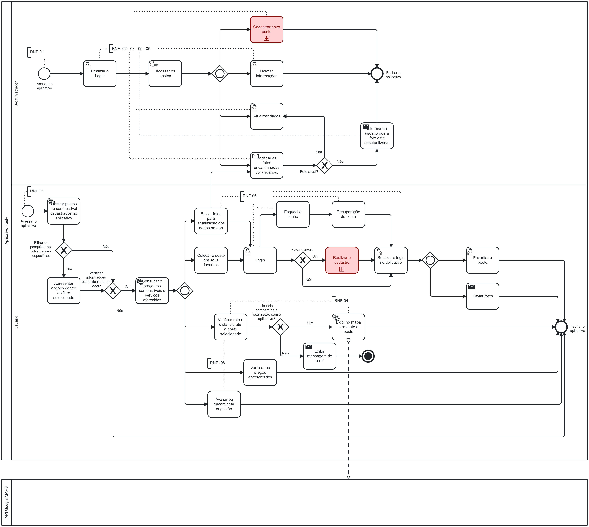

## Wireframes

Os wireframes são esboços iniciais que representam visualmente a estrutura básica de uma aplicação, eles fornecem uma visão geral do layout e organização dos elementos de uma tela. Nas páginas a seguir, você verá uma visão geral do projeto de interface, seguida pela explicação detalhada das principais telas, destacando os elementos e funcionalidades específicos de cada uma delas.

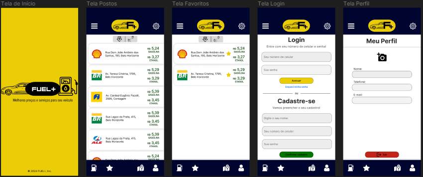
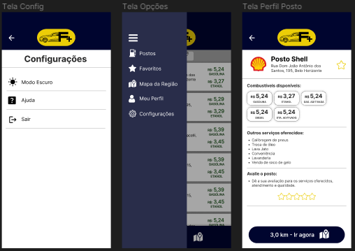 
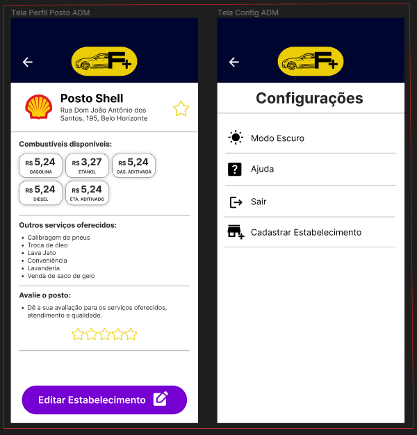

### Tela de Início:
A imagem acima ilustra a tela de início da aplicação, que é a primeira interação apresentada ao usuário após abrir o aplicativo. Neste wireframe, a logo e o slogan ocupam uma posição de destaque, enquanto os direitos autorais são exibidos abaixo, de forma clara e legível.

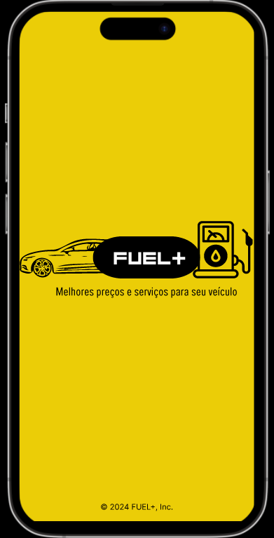

### Home Page:
Na página destacada abaixo, apresentamos a 'Home Page', que constitui a tela inicial da aplicação. A relevância da Home Page é inquestionável, pois é a primeira página que os usuários visualizam ao acessar o aplicativo. Por isso, priorizamos a exibição das informações mais importantes neste local. Na Home Page, os usuários encontram uma lista de postos cadastrados, exibindo seus endereços, preços e bandeiras. No topo da página, encontram-se nossa logomarca, um filtro de pesquisa e os botões de 'Menu' e 'Configurações'. Além disso, na parte inferior da página, disponibilizamos uma barra de tarefas que permite aos usuários navegar facilmente pela aplicação, com opções como 'Início', 'Favoritos', 'Mapa' e 'Perfil/Login'.

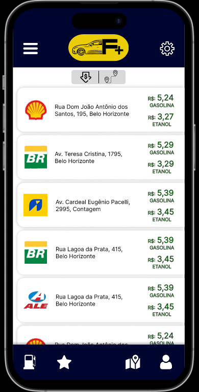

### Perfil do Posto:
A página de perfil do posto é projetada para ser uma fonte abrangente de informações, destinada a atender às necessidades do usuário. Ao clicar em um posto específico, o usuário é direcionado para a página de perfil, onde pode encontrar detalhes como horário de funcionamento, preços dos combustíveis disponíveis, rota até o local, além de outros serviços oferecidos por este mesmo posto. Além disso, os usuários têm a possibilidade de avaliar o estabelecimento, contribuindo para uma experiência mais completa.

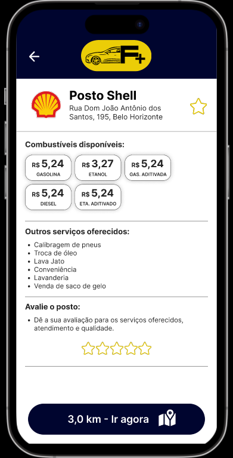

### Login:
A imagem abaixo ilustra o wireframe da tela de 'Login', na qual o usuário pode efetuar login ou se cadastrar no aplicativo. Esta função proporciona praticidade ao salvar informações do usuário, facilitando e disponibilizando mais recursos para o uso da aplicação.

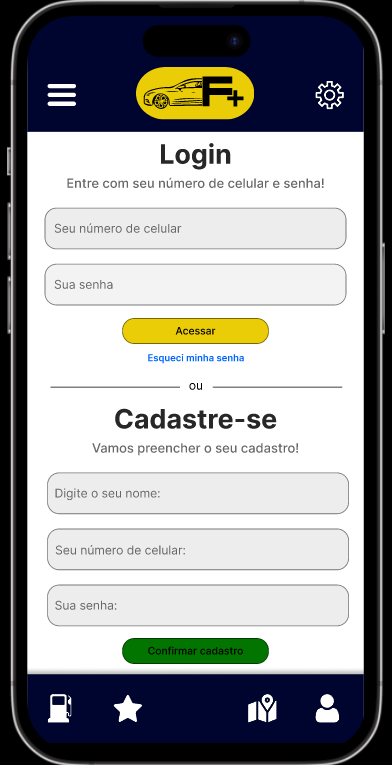

### Favoritos:
Com o objetivo de aprimorar a usabilidade da aplicação para o usuário, oferecemos a funcionalidade de favoritar postos de sua preferência. Dessa forma, o usuário pode acessar facilmente a tela de 'Favoritos' para visualizar com maior agilidade as suas escolhas previamente salvas, conforme exemplificado na tela abaixo.

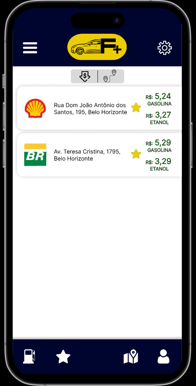

 ### Acesso Administrador:
O wireframe de acesso do administrador foi desenvolvido para fornecer uma representação visual da interface que um administrador do aplicativo terá ao acessar a plataforma. Essas telas foram criadas com o objetivo de oferecer uma visão clara e intuitiva das funcionalidades disponíveis para o administrador, incluindo a capacidade de editar postos já cadastrados e cadastrar novos estabelecimentos. Ao projetar essas telas, consideramos a necessidade do administrador de realizar essas tarefas de maneira eficiente e sem complicações. Portanto, o layout foi planejado para ser intuitivo e fácil de navegar, com controles e opções claramente identificáveis.

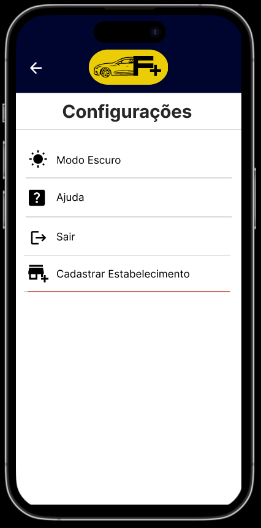 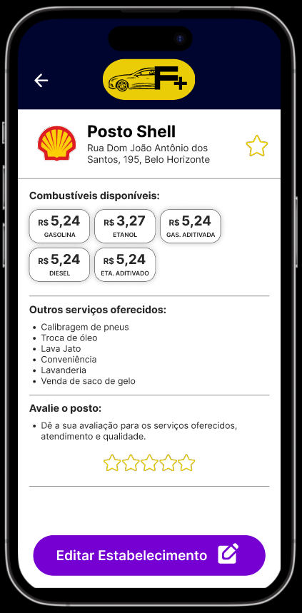

